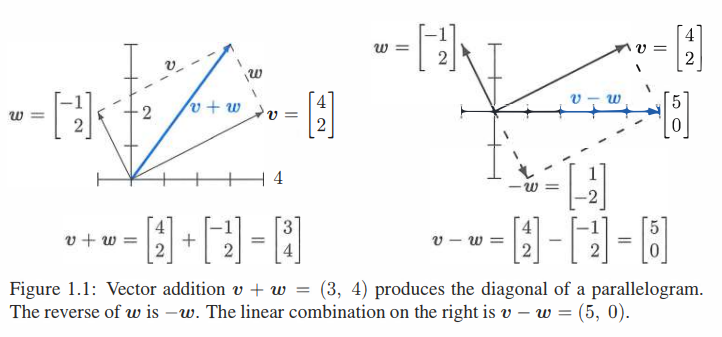
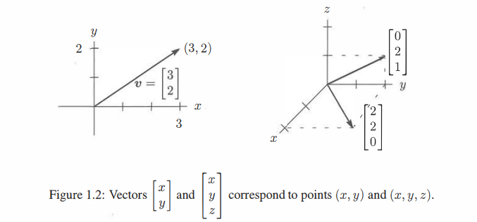
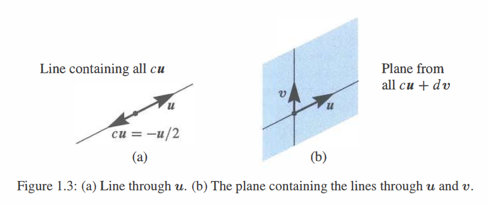

## 向量和线性组合

>1. \\(3\boldsymbol{v}+5\boldsymbol{w}\\) 是向量 \\(\boldsymbol{v}\\) 和 \\(\boldsymbol{w}\\) 的一个典型 **线性组合**。
>
>2. 对于 \\(\boldsymbol{v}=\begin{bmatrix} 1 \\\\ 2 \end{bmatrix}\\) 和 \\(\boldsymbol{w}=\begin{bmatrix} 2 \\\\ 3 \end{bmatrix}\\) 其组合为 \\(3\begin{bmatrix} 1 \\\\ 1 \end{bmatrix}+5\begin{bmatrix} 2 \\\\ 3 \end{bmatrix}=\begin{bmatrix}3+10\\\\3+15\end{bmatrix}=\begin{bmatrix}13\\\\18\end{bmatrix}\\)。
>
>3. 向量 \\(\begin{bmatrix}2\\\\3\end{bmatrix}=\begin{bmatrix}2\\\\0\end{bmatrix}+\begin{bmatrix}0\\\\3\end{bmatrix}\\) 在 \\(xy\\) 平面上经过 \\(x=2\\) 和 \\(y=3\\)。
>
>4. 组合 \\(c\begin{bmatrix}1\\\\1\end{bmatrix}+d\begin{bmatrix}2\\\\3\end{bmatrix}\\) 填满整个 \\(xy\\) 平面。它们可以生成每一个 \\(\begin{bmatrix}x\\\\y\end{bmatrix}\\)。
>
>5. 组合 \\(c\begin{bmatrix}1\\\\1\\\\1\end{bmatrix}+d\begin{bmatrix}2\\\\3\\\\4\end{bmatrix}\\) 填满 \\(xyz\\) 空间的一个**平面**。同 \\(\begin{bmatrix}1\\\\1\\\\1\end{bmatrix},\begin{bmatrix}3\\\\4\\\\5\end{bmatrix}\\) 生成的平面相同。
>
>6. 但是 \\(\begin{matrix}c+2d=1\\\\c+3d=0\\\\c+4d=0\end{matrix}\\) 无解因为该方程右端 \\(\begin{bmatrix}1\\\\0\\\\0\end{bmatrix}\\) 不在该平面上。

"你不能将苹果与橘子相加。" 奇怪的是，这就是向量的原因。我们有两个独立的数 \\(v_1\\) 和 \\(v_2\\)。该数对给出一个 ***二维向量*** \\(\boldsymbol{v}\\):
\\[
\textbf{列向量}\boldsymbol{v} \quad\quad \boldsymbol{v}=\begin{bmatrix}v_1\\\\v_2\end{bmatrix} \quad \begin{matrix}v_1=\boldsymbol{v}的第一个分量\\\\v_2=\boldsymbol{v}的第二个分量\end{matrix}
\\]
我们将 \\(\boldsymbol{v}\\) 写成 ***列*** 而不是行的形式。到目前为止的重点是用一个单独字母 \\(\boldsymbol{v}\\) (加粗斜体) 来表示数对 \\(v_1\\) 和 \\(v_2\\) (斜体)。

尽管我们不能将 \\(v_1\\) 和 \\(v_2\\) 相加，但我们会将 **向量相加**。\\(\boldsymbol{v}\\) 和 \\(\boldsymbol{w}\\) 的各个分量在加法中保持独立：
\\[
\begin{matrix}\textbf{向量}\\\\\textbf{加法}\end{matrix} \qquad \boldsymbol{v}=\begin{bmatrix}v_1\\\\v_2\end{bmatrix} \quad 和 \quad \boldsymbol{w}=\begin{bmatrix}w_1\\\\w_2\end{bmatrix} \quad 相加得到 \quad \boldsymbol{v}+\boldsymbol{w}=\begin{bmatrix}v_1+w_1\\\\v_2+w_2\end{bmatrix}.
\\]
减法遵循同样的规则：*\\(\boldsymbol{v}-\boldsymbol{w}\\) 的分量分别是 \\(v_1-w_1\\) 和 \\(v_2-w_2\\)。*

另一个基本的运算是 *标量乘法*。向量能与 2 或 -1 或任意数 \\(c\\) 相乘。为了得到 \\(2 \boldsymbol{v}\\)，令 \\(\boldsymbol{v}\\) 的每个分量乘 2 得到：

\\[
\begin{matrix}\textbf{标量}\\\\\textbf{乘法}\end{matrix} \qquad 2 \boldsymbol{v}=\begin{bmatrix}2v_1\\\\2v_2\end{bmatrix}=\boldsymbol{v}+\boldsymbol{v} \quad -\boldsymbol{v}=\begin{bmatrix}-v_1\\\\-v_2\end{bmatrix}.
\\]

\\(c \boldsymbol{v}\\) 的分量为 \\(cv_1\\) 和 \\(cv_2\\)。\\(c\\) 被称为“标量”。

注意 \\(-\boldsymbol{v}\\) 和 \\(\boldsymbol{v}\\) 的和是零向量。记作 \\(\mathbf{0}\\)，与数字 0 不同！向量 \\(\mathbf{0}\\) 分量为 0 和 0。请原谅我反复强调向量与其分量之间的差异。线性代数建立在这些运算 \\(\boldsymbol{v}+\boldsymbol{w}\\) 和 \\(c \boldsymbol{v}\\) 和 \\(d \boldsymbol{w}\\) 之上——***向量相加和标量相乘***。

### 线性组合

现在我们组合加法和标量乘法得到 \\(\boldsymbol{v}\\) 和 \\(\boldsymbol{w}\\)的 “**线性组合**”。将 \\(\boldsymbol{v}\\) 乘 \\(c\\)，\\(\boldsymbol{w}\\) 乘 \\(d\\)然后相加得到 \\(c \boldsymbol{v}+d \boldsymbol{w}\\)。

> ***\\(c \boldsymbol{v}\\) 和 \\(d \boldsymbol{w}\\) 的和是线性组合 \\(c \boldsymbol{v}+d \boldsymbol{w}\\)。***

四个特别的线性组合分别是：求和，作差，乘零和标量相乘：
\\[
\begin{align}
1 \boldsymbol{v}+1 \boldsymbol{w}&=\text{sum of vectors in Figure 1.1a} \\\\
1 \boldsymbol{v}-1 \boldsymbol{w}&=\text{difference of vectors in Figure 1.1b} \\\\
0 \boldsymbol{v}+0 \boldsymbol{w}&=\textbf{zero vector} \\\\
c \boldsymbol{v}+0 \boldsymbol{w}&=\text{vector}\ c \boldsymbol{v}\ \text{in the direction of}\ \boldsymbol{v}
\end{align}
\\]

零向量总是一个可能的线性组合 (它的系数为0)。每次我们得到一个向量的“空间”，都会包括零向量。这个大的视野，考虑 \\(\boldsymbol{v}\\) 和 \\(\boldsymbol{w}\\) 的所有线性组合，就是线性代数要做的事。

下面的图展示了你可以怎样可视化向量。对于代数而言，我们只需要分量 (比如 4 和 2)。那个向量 \\(\boldsymbol{v}\\) 被表示为一个箭头。该箭头在向右经过 \\(v_1=4\\) 个单位长度，向上通过 \\(v_2=2\\) 个单位长度。它最终止于一个点，其 \\(x,y\\) 坐标是 \\(4,2\\)。该点是这个向量的另一种表示——所以我们有三种方式去描述 \\(\boldsymbol{v}\\)：

>\\[向量\boldsymbol{v}的表示 \qquad 两个数字 \quad 始于 (0,0) 的箭头 \quad 平面上的点\\]

相加使用数字。可视化 \\(\boldsymbol{v}+\boldsymbol{w}\\) 使用箭头：***向量加法 (头尾相接)，在 \\(\boldsymbol{v}\\) 的终点放置 \\(\boldsymbol{w}\\) 的起点。***

我们先沿着 \\(\boldsymbol{v}\\) 然后沿着 \\(\boldsymbol{w}\\) 行进。或者我们沿着对角线 \\(\boldsymbol{v}+\boldsymbol{w}\\) 走捷径。当然我们也可以先沿着 \\(\boldsymbol{w}\\) 再沿着 \\(\boldsymbol{v}\\)。换句话说，\\(\boldsymbol{w}+\boldsymbol{v}\\) 给出与 \\(\boldsymbol{v}+\boldsymbol{w}\\) **相同的答案**。这些是沿着平行四边形的不同方式（在这个例子中它是一个矩形）。

### 三维向量

有两个分量的向量关联到 \\(xy\\) 平面的一个点。\\(\boldsymbol{v}\\) 的分量为该点的坐标：\\(x=v_1\\) 和 \\(y=v_2\\)。当从 \\((0,0)\\) 出发时，箭头终于点 \\((v_1,v_2)\\)。现在允许向量有三个分量 \\(v_1,v_2,v_3\\)。

\\(xy\\) 平面被三维 \\(xyz\\) 平面取代。下面是一些经典的向量 (仍然是列向量但有三个分量)：

\\[
\boldsymbol{v}=\begin{bmatrix}1\\\\1\\\\-1\end{bmatrix}\quad 和 \quad \boldsymbol{w}=\begin{bmatrix}2\\\\3\\\\4\end{bmatrix}\quad 和 \quad \boldsymbol{v}+\boldsymbol{w}=\begin{bmatrix}3\\\\4\\\\3\end{bmatrix}.
\\]

向量 \\(\boldsymbol{v}\\) 关联到三维空间的一个箭头。通常该箭头始于“原点”，\\(xyz\\) 轴交于该点且坐标为 \\((0,0,0)\\)。箭头终于坐标为 \\(v_1,v_2,v_3\\) 的点。在 ***列向量*** 和 ***始于原点的箭头*** 和 ***箭头终止的点*** 这三者之间有一个完美的对应。

平面中的向量 \\((x,y)\\) 与三维空间 \\((x,y,0)\\) 是不同的！

>从现在开始 \\(\boldsymbol{v}=\begin{bmatrix}1\\\\1\\\\-1\end{bmatrix}\\) 也可以写成 \\(\boldsymbol{v}=(1,1,-1)\\)。

为了节省空间，将向量表示为行的形式 (位于括号中)。但是 \\(\boldsymbol{v}=(1,1,-1)\\) 不是行向量！它毫无疑问是列向量，只是暂时躺平了。行向量 \\(\begin{bmatrix}1&1&-1\end{bmatrix}\\) 是完全不同的概念，尽管它有相同的三个分量。这个 \\(1\times3\\) 行向量是 \\(3\times1\\) 列向量 \\(\boldsymbol{v}\\) 的“转置”。

在三维情况下，\\(\boldsymbol{v}+\boldsymbol{w}\\) 仍然一次计算一个分量。此时向量和有分量 \\(v_1+w_1\\)，\\(v_2+w_2\\) 和 \\(v_3+w_3\\)。向量加法在 4 或 5 或者 \\(n\\) 维上与此类似。当 \\(\boldsymbol{w}\\) 起始于 \\(\boldsymbol{v}\\) 的终点时，第三条边就是 \\(\boldsymbol{v}+\boldsymbol{w}\\)。另一个方式是沿着平行四边形得到 \\(\boldsymbol{v}+\boldsymbol{w}\\)。问：这四条边是否位于同一平面吗？*是*。并且和 \\(\boldsymbol{v}+\boldsymbol{w}-\boldsymbol{v}-\boldsymbol{w}\\) 围绕一圈产生零向量。

三维空间中三个向量的线性组合的例子为 \\(\boldsymbol{u}+4\boldsymbol{v}-2\boldsymbol{w}\\)：

\\(
\begin{matrix}
\text{Linear combination}\\\\
\text{Multiply by 1,4,-2}\\\\
\text{Then add}
\end{matrix}
\qquad \qquad
\begin{bmatrix}
1\\\\0\\\\3
\end{bmatrix}+
4\begin{bmatrix}
1\\\\2\\\\1
\end{bmatrix}-
2\begin{bmatrix}
2\\\\3\\\\-1
\end{bmatrix}=
\begin{bmatrix}
1\\\\2\\\\9\end{bmatrix}.
\\)

### 几个重要问题

对于单个向量 \\(\boldsymbol{u}\\)，唯一可能线性组合是向量乘法 \\(c \boldsymbol{u}\\)。对于两个向量，其组合为 \\(c \boldsymbol{u}+d \boldsymbol{v}\\)。对于三个向量，线性组合为 \\(c \boldsymbol{u}+d \boldsymbol{v}+ e \boldsymbol{w}\\)。你能从 *一个* 线性组合迈向 **所有线性组合** 吗？即任意的 \\(c\\), \\(d\\) 和 \\(e\\)。假设向量 \\(\boldsymbol{u}\\)，\\(\boldsymbol{v}\\)，\\(\boldsymbol{w}\\) 都位于三维空间：

1. \\(c \boldsymbol{u}\\) 的所有组合的图像是怎样的？
2. \\(c \boldsymbol{u}+d \boldsymbol{v}\\) 的所有组合的图像是怎样的？
3. \\(c \boldsymbol{u}+d \boldsymbol{v}+e \boldsymbol{w}\\) 的所有组合的图像是怎样的？

答案取决于 \\(\boldsymbol{u}\\)，\\(\boldsymbol{v}\\) 和 \\(\boldsymbol{w}\\) 的具体取值。如果均为零向量 (一个十分极端的情况)，那每个组合都将是零。如果它们是非零向量 (分量随机取值)，则有三个可能的答案。这是我们学科的关键：

1. \\(c \boldsymbol{u}\\) 的所有组合均位于一条 ***经过 \\((0,0,0)\\) 的直线***。
2. \\(c \boldsymbol{u}+d \boldsymbol{v}\\) 的所有组合填满 ***包含 \\((0,0,0)\\) 的平面***。
3. \\(c \boldsymbol{u}+d \boldsymbol{v}+e \boldsymbol{w}\\) 的所有组合填满 ***整个三维空间***。

零向量 \\((0,0,0)\\) 位于直线上是因为 \\(c\\) 可以取零。位于平面上是因为 \\(c\\) 和 \\(d\\) 可以同时取零。向量 \\(c \boldsymbol{u}\\) 的直线无限长 (前向和后向)。对于 \\(c \boldsymbol{u}+d \boldsymbol{v}\\)(在三维空间中组合两个向量) 的平面则要求你自己仔细思考。

*将一条线上的所有向量 \\(c \boldsymbol{v}\\) 同另一条线上的所有向量 \\(d \boldsymbol{v}\\) 相加能填满 Figure 1.3 的平面。*

当包含第三个向量 \\(\boldsymbol{w}\\) 时，\\(e \boldsymbol{w}\\) 给定第三条线。**假设第三条线不在 \\(\boldsymbol{u}\\) 和 \\(\boldsymbol{v}\\) 的平面中**。那么将所有 \\(c \boldsymbol{u}+d \boldsymbol{v}\\) 与所有 \\(e \boldsymbol{w}\\) 组合将会填满整个三维空间。

这是典型的情况！从 **直线** 到 **平面** 再到 **空间**。但是还存在其他的可能性。当 \\(\boldsymbol{w}\\) 恰好为 \\(c \boldsymbol{u}+d \boldsymbol{v}\\) 时，第三个向量 \\(\boldsymbol{w}\\) 就位于前两个向量的平面中。此时 \\(\boldsymbol{u},\boldsymbol{v},\boldsymbol{w}\\) 的线性组合将不会超出 \\(\boldsymbol{u}\boldsymbol{v}\\) 平面。我们将不能得到整个三维空间。请在问题 1 中思考这个特殊情况。

#### 关键思想回顾

1. 二维空间中的向量 \\(\boldsymbol{v}\\) 有两个分量 \\(v_1\\) 和 \\(v_2\\)。
2. \\(\boldsymbol{v}+\boldsymbol{w}=(v_1+w_1,v_2+w_2)\\) 和 \\(c \boldsymbol{v}=(cv_1,cv_2)\\) 均按分量分别计算得到。
3. 三个向量 \\(\boldsymbol{u}\\)，\\(\boldsymbol{v}\\) 和 \\(\boldsymbol{w}\\) 的一个线性组合为 \\(c \boldsymbol{u}+d \boldsymbol{v}+e \boldsymbol{w}\\)。
4. 取 \\(\boldsymbol{u}\\) 或 \\(\boldsymbol{u}\\) 和 \\(\boldsymbol{v}\\) 或 \\(\boldsymbol{u}\\)，\\(\boldsymbol{v}\\) 和 \\(\boldsymbol{w}\\) 的所有线性组合。在三维情况下，这些组合一般分别填满一条直线，一个平面和整个空间 \\(\mathbf{R}^3\\)。

#### 典型示例

**1.1 A**    
\\(\boldsymbol{v}=(1,1,0)\\) 和 \\(\boldsymbol{w}=(0,1,1)\\) 的线性组合填充 \\(\mathbf{R}^3\\) 的一个平面。*描述该平面*。请给出一个不是 \\(\boldsymbol{v}\\) 和 \\(\boldsymbol{w}\\) 线性组合的向量——其不在平面上。

**解**    
\\(\boldsymbol{v}\\) 和 \\(\boldsymbol{w}\\) 的平面包含所有的线性组合 \\(c \boldsymbol{v}+d \boldsymbol{w}\\)。位于该平面上的向量允许任意的 \\(c\\) 和 \\(d\\)。Figure 1.3 的平面由两条线所填充。

>线性组合 \\(c \boldsymbol{v}+d \boldsymbol{w}=c \begin{bmatrix}1\\\\1\\\\0\end{bmatrix}+d \begin{bmatrix}0\\\\1\\\\1\end{bmatrix}=\begin{bmatrix}c\\\\c+d\\\\d\end{bmatrix}\\) 填满一个平面。

位于该平面上的四个向量分别为 \\((0,0,0)\\)，\\((2,3,1)\\)，\\((5,7,2)\\) 和 \\((\pi, 2\pi, \pi)\\)。第二个分量 \\(c+d\\) 总是第一个和第三个分量的和。和大多数向量一样，\\((1,2,3)\\) **不** 在该平面上，*因为* \\(2 \not =1+3\\)。

关于这个经过 \\((0,0,0)\\) 的平面的另一个描述方式是知道 \\(\boldsymbol{n}=(1,-1,1)\\) **垂直于** 这个平面。1.2 节将会通过点积证明这个 \\(90^{\circ}\\) 角：\\(\boldsymbol{v}\cdot \boldsymbol{n}=0\\) 和 \\(\boldsymbol{w}\cdot \boldsymbol{n}=0\\)。相互垂直的向量点积为零。

**1.1 B**    
对于 \\(\boldsymbol{v}=(1,0)\\) 和 \\(\boldsymbol{w}=(0,1)\\)，通过 \\((1)\\) 全体数 \\(c\\) \\((2)\\) 非负数 \\(c \geq 0\\) 描述所有的点 \\(c \boldsymbol{v}\\)。然后加上所有的向量 \\(d \boldsymbol{w}\\) 描述所有的 \\(c \boldsymbol{v}+d \boldsymbol{w}\\)。

**解**    
\\((1)\\) \\(c\\) 取全体数的向量 \\(c \boldsymbol{v}=(c,0)\\) 等价于 \\(x\\) 轴上一系列的点 (沿 \\(\boldsymbol{v}\\) 的方向)。包括 \\((-2,0),(-1,0),(0,0),(1,0),(2,0)\\)。

\\((2)\\) \\(c \geq 0\\) 时向量 \\(c \boldsymbol{v}\\) 覆盖 **半线**，即 \\(x\\) 正半轴。这条半线始于 \\((0,0)\\)，此时 \\(c=0\\)。包括 \\((100,0)\\) 和 \\((\pi,0)\\) 但不包括 \\((-100,0)\\)。

\\((1^{\prime})\\) 添加所有向量 \\(d \boldsymbol{w}=(0,d)\\) 得到一条垂直于所有点 \\(c \boldsymbol{v}\\) 的线。我们还有无穷多 **平行线**，取 (*全体数* \\(c\\)，*任意数* \\(d\\))。
 
\\((2^{\prime})\\) 添加所有向量 \\(d \boldsymbol{w}=(0,d)\\) 得到一条垂直于位于半线上的 \\(c \boldsymbol{v}\\) 的线。现在我们得到一个 **半平面**。\\(xy\\) 平面右半部分有 \\(x\geq0\\) 和 所有 \\(y\\)。

**1.1 C**   
找出两个关于 \\(c\\) 和 \\(d\\) 的方程满足 **线性组合 \\(c \boldsymbol{v}+d \boldsymbol{w}\\) 等于 \\(b\\)**：
\\[
\boldsymbol{v} = \begin{bmatrix}2\\\\-1\end{bmatrix} \quad
\boldsymbol{w} = \begin{bmatrix}-1\\\\2\end{bmatrix} \quad
\boldsymbol{b} = \begin{bmatrix}1\\\\0\end{bmatrix}.
\\]

**解**   
在应用数学中，许多问题分为两部分：
1. *建模部分*： 用一系列的方程表述问题。
2. *计算部分*： 通过快速和准确的算法解上述方程。

这里只要求第一部分 (方程)。第 2 章专门介绍第二部分 (解)。我们的示例适合线性代数的基本模型： 

>找到 \\(n\\) 个数 \\(c_1,\ldots,c_n\\) 满足 \\(c_1 \boldsymbol{v}_1+\ldots+c_n \boldsymbol{v}_n=\boldsymbol{b}\\).
   
当 \\(n=2\\) 时我们会找到一个关于 \\(\boldsymbol{c}\\) 的公式。第 2 章的“消除法” 能应用远大于 \\(n=1000\\) 的情况。对于超过 10 亿的 \\(n\\) 的情况，参见第 11 章。这里 \\(n=2\\)：

> \\(
\begin{matrix}\textbf{向量方程}\\\\c \boldsymbol{v}+d \boldsymbol{w}=\boldsymbol{b}\end{matrix} \qquad \qquad
c \begin{bmatrix}2\\\\-1\end{bmatrix}+d \begin{bmatrix}-1\\\\2\end{bmatrix}=\begin{bmatrix}1\\\\0\end{bmatrix}
\\)

所要求的关于 \\(c\\) 和 \\(d\\) 的方程分别来自于两个分量：   
\\[\textbf{两个普通方程}\qquad \qquad \begin{bmatrix}2c-d=1\\\\-c+2d=0\end{bmatrix}\\]
每个方程得到一条直线。两直线在解 \\(c=\frac 23,d=\frac 13\\) 相交。为什么不将其看作一个 **矩阵方程**，这样将得到：
\\[
\textbf{2}\times\textbf{2 矩阵} \qquad \begin{bmatrix}2&-1\\\\-1&2\end{bmatrix} \begin{bmatrix}c\\\\d\end{bmatrix}=\begin{bmatrix}1\\\\0\end{bmatrix}.\\]
