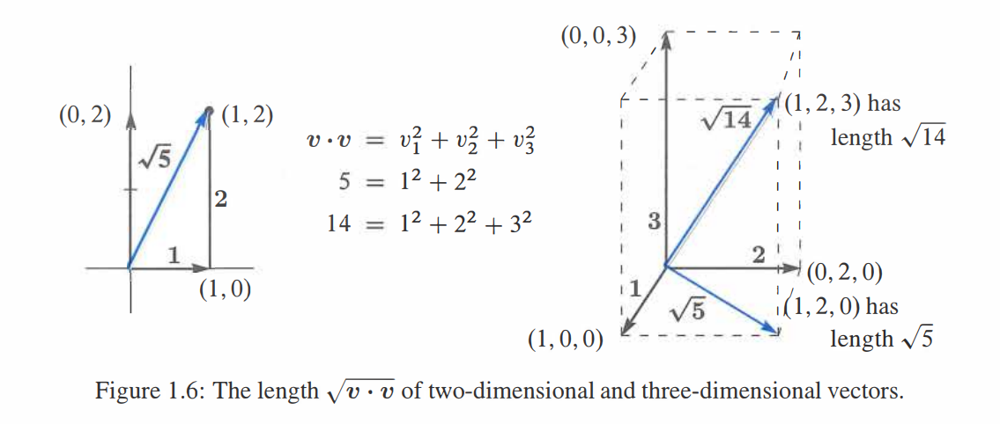
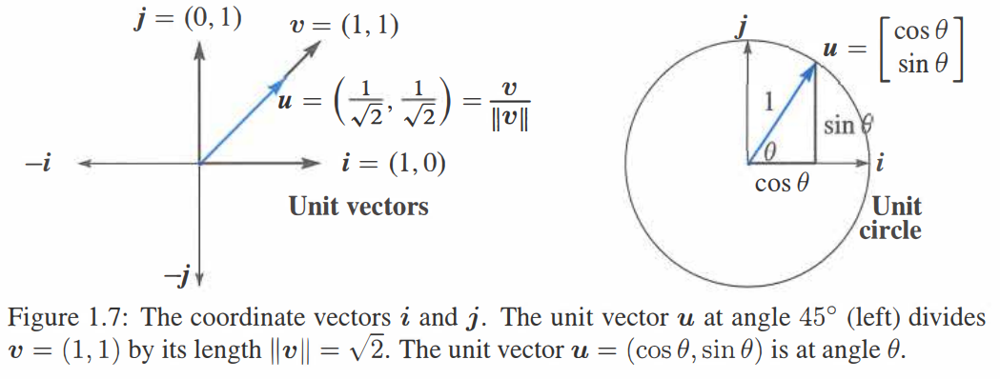
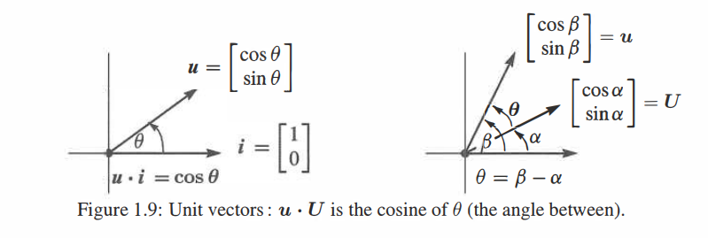

## 长度和点积

>1. \\(v=\begin{bmatrix}1\\\\2\end{bmatrix}\\) 和 \\(w=\begin{bmatrix}4\\\\5\end{bmatrix}\\) 的点积为 \\(v\cdot w=(1)(4)+(2)(5)=4+10=14\\)。
>
>2. \\(v=\begin{bmatrix}1\\\\3\\\\2\end{bmatrix}\\) 和 \\(w=\begin{bmatrix}4\\\\-4\\\\4\end{bmatrix}\\) 互相垂直因为 \\(v\cdot w=0\\)。
> 
>3. \\(v=\begin{bmatrix}1\\\\3\\\\2\end{bmatrix}\\) 长度的平方为 \\(v\cdot v=1+9+4=14\\)。长度为 \\(||v||=\sqrt{14}\\)。
> 
>4. \\(u=\dfrac{v}{||v||}=\dfrac{v}{\sqrt{14}}=\dfrac {1}{\sqrt{14}}\begin{bmatrix}1\\\\3\\\\2\end{bmatrix}\\) 则有长度 \\(||u||=1\\)，因为 \\(\dfrac{1}{14}+\dfrac{9}{14}+\dfrac{4}{14}=1\\)。
>
>5. \\(v\\) 和 \\(w\\) 的夹角 \\(\theta\\) 满足 \\(\cos {\theta}=\dfrac{v\cdot w}{||v||\ ||w||}\\)。
>
>6. \\(\begin{bmatrix}1\\\\0\end{bmatrix}\\) 与 \\(\begin{bmatrix}1\\\\0\end{bmatrix}\\) 的夹角满足 \\(\cos{\theta}=\dfrac{1}{(1)(\sqrt 2)}\\)，该夹角 \\(\theta=45^{\circ}\\)。
> 
>7. 任意夹角都满足 \\(|\cos{\theta}|\leq1\\)，所以对于任意向量均有 \\(\boxed{|v\cdot w|\leq||v||\ ||w||}\\)。

第一节介绍了向量数乘。现在我们进一步定义 \\(v\\) 和 \\(w\\) 的 *点积*。该乘法操作包含了两个分别的乘积 \\(v_1w_1\\) 和 \\(v_2w_2\\) 但不止于此。将这两个数相加得到单个的数 \\(v\cdot w\\)。  
*该小节是关于几何的章节 (向量的长度和其夹角的余弦值)。*

\\(v=(v_1,v_2)\\) 和 \\(w=(w_1,w_2)\\) 的 **点积** 或者 **内积** 为数 \\(v\cdot w\\):
\\[\tag{1}v\cdot w=v_1w_1+v_2w_2.\\]
**例1** \\(v=(4,2)\\) 和 \\(w=(-1,2)\\) 点积为零:
\\[
\begin{bmatrix}4\\\\2\end{bmatrix} \cdot \begin{bmatrix}-1\\\\2\end{bmatrix}=-4+4=0.
\\]
> 点积为零，向量相互垂直。

在数学中，零总是特殊的数字。对于点积它意味着 *向量相互垂直*，夹角为 \\(90^{\circ}\\)。当将其绘制在 \\(Figure 1.1\\) 中时，我们看到的是矩形 (不是任何可能的平行四边形)。关于垂直向量最简单直观的例子为沿着 \\(x\\) 轴 \\(i=(1,0)\\) 和沿 \\(y\\) 轴的 \\(j=(0,1)\\)，点积为 \\(i \cdot j=0+0=0\\)。向量 \\(i\\) 和 \\(j\\) 构成一个直角。   
\\(v=(1,2)\\) 和 \\(w=(3,1)\\) 的点积是 \\(5\\)。\\(v\cdot w\\) 之后会揭示 \\(v\\) 和 \\(w\\) 之间的夹角 (不是\\(90^{\circ}\\))。请验证 \\(w \cdot v\\) 结果也是 \\(5\\)。   
> 点积 \\(w\cdot v\\) 等于 \\(v\cdot w\\)。\\(v\\) 和 \\(w\\) 的顺序对结果没有影响。

**例2** 赋予点 \\(x=-1\\) (零的左边) \\(4\\) 的权重而点 \\(x=2\\) (零的右边) \\(2\\) 的权重，则 \\(x\\) 轴将会在中心点平衡 (像跷跷板一样)。两边重量平衡是因为由点积的 \\((4)(-1)+(2)(2)=0\\)。  
这个例子在工程和科学领域中十分经典。权重向量 \\(w_1,w_2=(4,2)\\)，而相对于中心的距离向量 \\(v_1,v_2=(-1,2)\\)。权重与距离相乘，\\(w_1v_1\\) 和 \\(w_2v_2\\) 得到 “矩(moments)”。关于跷跷板平衡的方程为 \\(w_1v_1+w_2v_2=0\\)。

**例3** 点积也出现在金融和商业领域。我们需要购买和出售三种物品。它们的单个价格分别为 \\(p_1,p_2,p_3\\)——即 “价格向量” \\(p\\)。我们购买或者出售的数量为 \\(q_1,q_2,q_3\\)——出售为正，购买为负。以价格 \\(p_1\\) 售出 \\(q_1\\) 件物品会得到 \\(q_1p_1\\) 的收益。总收益 (数量 \\(q\\) 乘以价格 \\(p\\)) 为**三维空间上的点积 \\(q \cdot p\\)：**  
**收益** \\(=(q_1,q_2,q_3) \cdot (p_1,p_2,p_3)=q_1p_1+q_2p_2+q_3+p_3=\\) **点积**。

点积为零的情况意味着 “收支平衡”。若 \\(q \cdot p=0\\) 则出售总额等于订购总额，此时 \\(p\\) 垂直于 \\(q\\) (在三维空间)。一家具有数千种商品的超市很容易陷入高维情形。

小笔记：电子表格在经营管理中已经成为必不可少的一部分，它们计算线性组合和点积，在屏幕上表现为一个矩阵。

**重点** 考虑 \\(v \cdot w\\)，将 \\(v_i\\) 和 \\(w_i\\) 两两相乘，从而有 \\(v \cdot w=v_1w_1+\cdots+v_nw_n\\)。

### 长度和单位向量

一种重要的情形是向量与自身的点积。在这种情况下 \\(v=w\\)。当向量为 \\(v=(1,2,3)\\) 时，关于自身的点积为 \\(v \cdot v=||v||^2=14\\)：
\\[
||v||^2=\begin{bmatrix}1\\\\2\\\\3\end{bmatrix} \cdot \begin{bmatrix}1\\\\2\\\\3\end{bmatrix}=1+4+9=14
\\]
> 向量自身的点积等于长度的平方。  

与 向量间的 \\(90^{\circ}\\) 夹角相反此时我们得到 \\(0^{\circ}\\)。结果不是零是因为 \\(v\\) 不垂直于自身。由点积 \\(v \cdot v\\) 得到 *\\(v\\) 的长度的平方*。 

**定义** 向量 \\(v\\) 的**长度** \\(||v||\\) 是 \\(v \cdot v\\) 的平方根：
\\[\textbf{长度}=||v||=\sqrt{v \cdot v}=(v^2_1+v^2_2+\cdots+v^2_n)^{\frac 1 2}.\\]
在二维时长度是 \\(\sqrt{v^2_1+v^2_2}\\)，三维时它为 \\(\sqrt{v^2_1+v^2_2+v^2_3}\\)。根据之前的计算，\\(v=(1,2,3)\\) 的长度为 \\(||v||=\sqrt{14}\\)。  
这里 \\(||v||=\sqrt{v \cdot v}\\) 只是代表该向量的箭头的平凡长度。如果分量分别为 \\(1\\) 和 \\(2\\)，则箭头为所成直角三角形的第三条边 (Figure 1.6)。毕达哥拉斯公式 \\(a^2+b^2=c^2\\) 联系了三条边：\\(1^2+2^2=||v||^2\\)。

对于 \\(v=(1,2,3)\\) 的长度，我们使用两次直角三角形公式。位于底部的向量 \\((1,2,0)\\) 长度为 \\(\sqrt{5}\\)。该底向量垂直于向上的向量 \\((0,0,3)\\)。所以该盒子的对角线具有长度 \\(||v||=\sqrt{5+9}=\sqrt{14}\\)。  
四维向量的长度为 \\(\sqrt{v^2_1+v^2_2+v^2_3+v^2_4}\\)。因此向量 \\((1,1,1,1)\\) 长度为 \\(\sqrt{1^2+1^2+1^2+1^2}=2\\)，这是位于四维空间的具有单位长度的块的对角线。类似的对角线在 \\(n\\) 维空间中具有长度 \\(\sqrt{n}\\)。

单词“单位”总是代表某个等于“一”的度量。单位价格表示一个物品的价格。一个单位块具有长度为一的边。单位圆表示半径为一的圆。现在我们看下“单位向量”意味着什么。

**定义** **单位向量 \\(u\\) 是一个长度等于一的向量**。从而有 \\(u \cdot u=1\\)。

一个四维空间的例子是 \\(u=(\sqrt{\frac 1 2},\sqrt{\frac 1 2},\sqrt{\frac 1 2},\sqrt{\frac 1 2})\\)，\\(u \cdot u=\sqrt{1 4}+\sqrt{1 4}+\sqrt{1 4}+\sqrt{1 4}=1\\)。通过将向量 \\(v=(1,1,1,1)\\) 除以其长度 \\(||v||=2\\) 得到这个单位向量。

**例4** 沿 \\(x\\) 和 \\(y\\) 轴的标准单位向量写作 \\(i\\) 和 \\(j\\)。在 \\(xy\\) 平面上，与 \\(x\\) 轴成角度 \\(\theta\\) 的单位向量为 \\((\cos{\theta},\sin{\theta})\\)：
\\[i=\begin{bmatrix}1\\\\0\end{bmatrix}\quad j=\begin{bmatrix}0\\\\1\end{bmatrix} \quad u=\begin{bmatrix}\cos{\theta}\\\\\sin{\theta}\end{bmatrix}.\\]
当 \\(\theta=0\\)，水平向量 \\(u=i\\)。当\\(\theta=90^{\circ}\\) (或者 \\(\frac {\pi} 2\\) 弧度)，竖直向量 \\(u=j\\)。取任意角度，由于 \\(\cos^2{\theta}+\sin^2{\theta}=1\\) 分量 \\(\cos{\theta}\\) 和 \\(\sin{\theta}\\) 均得到 \\(u \cdot u=1\\)。这些向量遍布在 Figure 1.7 上的单位圆上。因此 \\(\cos{\theta}\\) 和 \\(\sin{\theta}\\) 仅仅是单位圆上成 \\(\theta\\) 角的点的坐标。  
由于 \\((2,2,1)\\) 长度为 3，故向量 \\(\frac {2} {3},\frac {2} {3},\frac {1} {3}\\) 长度为 1。验证可得 \\(u \cdot u=\frac {4} {9}+\frac {4} {9}+\frac {1} {9}=1\\)。为了得到一个单位向量，可将任何非零向量 \\(v\\) 除以其长度 \\(||v||\\)。

> **单位向量** \\(u=v/||v||\\) 是与 \\(v\\) 同方向的单位向量。

### 向量间夹角
我们表述过垂直向量满足 \\(v \cdot w=0\\)。当角度为 \\(90^{\circ}\\) 时点积为零。为了说明这个关系我们必须将角度关联到点积。之后我们将会展示如何通过 \\(v \cdot w\\) 找到非零向量 \\(v\\) 和 \\(w\\) 的夹角。

**直角** 当 \\(v\\) 垂直于 \\(w\\) 时点积 \\(v \cdot w=0\\)。

**证明** 当 \\(v\\) 和 \\(w\\) 相互垂直时，它们组成直角三角形的两边。第三边是 \\(v-w\\) (穿过Figure 1.8 的斜边)。关于直角三角形的 *毕达哥拉斯定律* 是 \\(a^2+b^2=c^2\\)。
\\[\tag{2} \textbf{垂直的向量}\quad||v||^2+||w||^2=||v-w||^2\\]
在二维情形时写出上述公式，方程为
\\[\tag{3} (v^2_1+v^2_2)+(w^2_1+w^2_2)=(v_1-w_1)^2+(v_2-w_2)^2\\]
等式右边第一项展开为 \\(v^2_1-2v_1w_1+w^2_1\\)，\\(v^2_1\\) 和 \\(w^2_1\\) 出现在方程左右两边于是可以消去，余下 \\(-2v_1w_1\\)。同理 \\(v^2_2\\) 和 \\(w^2_2\\) 也被消去，剩下 \\(-2v_2w_2\\)。(在三维情况下还会有一项 \\(-2v_3w_3\\)。) 现在除以 \\(-2\\) 得到 \\(v-w=0\\)：
\\[\tag{4} 0=-2v_1w_1-2v_2w_2 \Rightarrow v_1w_1+v_2w_2=0.\\]
**结论** 直角得到 \\(v \cdot w=0\\)。当角度为 \\(90^{\circ}\\) 时点积为零，\\(\cos{\theta}=0\\)。零向量 \\(v=0\\) 垂直于任意向量 \\(w\\) 因为 \\(0 \cdot w\\) 总是零。  
现在假设 \\(v\cdot w\\) **不为零**。它可能为正也可能为负。\\(v \cdot w\\) 的正负号可以立刻告诉我们角度是大于还是小于 \\(90^{\circ}\\)。当 \\(v \cdot w\\) 为正时角度小于 \\(90^{\circ}\\)，为负时角度大于 \\(90^{\circ}\\)。Figure 1.8 右边展示了一个示例向量 \\(v=(3,1)\\)。与 \\(w=(1,3)\\) 的夹角小于 \\(90^{\circ}\\)，因为 \\(v \cdot w=6\\) 为正。

边界线说明了向量垂直于 \\(v\\) 时的位置。在那条位于正号和负号之间的线上，\\((1,-3)\\) 垂直于 \\((3,1)\\)，点积为零。  
**点积揭示了精确的角度值**。对于单位向量 \\(u\\) 和 \\(U\\)，\\(u \cdot U\\) 的符号告诉我们 \\(\theta \lt 90^{\circ}\\) 还是 \\(\theta \gt 90^{\circ}\\)。更进一步，点积 \\(u \cdot U\\) 是夹角 \\(\theta\\) 的余弦值，这在 \\(n\\) 维情况依然为真。

> 夹角为 \\(\theta\\) 的单位向量 \\(u\\) 和 \\(U\\) 满足 \\(u \cdot U=\cos{\theta}\\)。故显然 \\(|u \cdot U| \le 1\\)。

请记住 \\(\cos{\theta}\\) 不可能大于 \\(1\\)，不可能小于 \\(-1\\)。故 *单位向量的点积位于 \\(-1\\) 和 \\(1\\) 之间*。**\\(\theta\\) 的余弦值由 \\(u \cdot U\\) 得到**。  
Figure 1.9 清晰地展示了向量为 \\(u=(\cos{\theta},\sin{\theta})\\) 和 \\(i=(1,0)\\) 时的情况。点积为 \\(u \cdot i=\cos{\theta}\\)，这是它们之间夹角的余弦值。  
在旋转任意角度 \\(\alpha\\) 后，向量 \\(u\\) 旋转到 \\((\cos{\beta},\sin{\beta})\\)，其中 \\(\beta=\alpha+\theta\\)。这时点积为 \\(\cos{\alpha}\cos{\beta}+\sin{\alpha}\sin{\beta}\\)。根据三角函数这是 \\(\cos{(\beta-\alpha)}=\cos{\theta}\\)。

如果 \\(v\\) 和 \\(w\\) 不是单位向量会怎样呢？通过除以它们的长度可以得到 \\(u=v/||v||\\) 和 \\(U=w/||w||\\)，单位向量\\(u\\) 和 \\(U\\)的点积给出 \\(\cos{\theta}\\)。

> **余弦公式** 若 \\(v\\) 和 \\(w\\) 为非零向量则 \\(\frac{v \cdot w} {||v||\ ||w||}=\cos{\theta}\\)。

不论夹角多少度，关于 \\(v/||v||\\) 和 \\(w/||w||\\) 的点积不会超过一。这就是关于点积的 **“Schwarz inequality”** \\(|v \cdot w| \le ||v||\ ||w||\\)——或更正式地说法是 Cauchy-Schwarz-Buniakowsky 不等式。它在法国和德国还有俄罗斯被首次发现 (可能还有其他地方——它是数学上最重要的不等式)。  
由于 \\(|\cos{\theta}|\\) 总是不超过 1，故余弦公式给出下面两个伟大的不等式：  
> **SCHWARZ INEQUALITY** \\(v \cdot w \lt ||v||\ ||w||\\)  
> **TRIANGLE INEQUALITY** \\(||v+w|| \lt ||v||+||w||\\)

**例5** 求 \\(v=\begin{bmatrix}2\\\\1\end{bmatrix}\\) 和 \\(w=\begin{bmatrix}1\\\\2\end{bmatrix}\\) 的 \\(\cos{\theta}\\) 并验证两个不等式。  
**解** 点积 \\(v \cdot w=4\\)。\\(v\\) 和 \\(w\\) 长度均为 \\(\sqrt{5}\\)。则余弦值为 \\(\frac 4 5\\)。
\\[\cos{\theta}=\frac {v \cdot w} {||v||\ ||w||}=\frac {4} {\sqrt5\sqrt5}=\frac 4 5.\\]
根据施瓦兹不等式，\\(v \cdot w=4\\) 小于 \\(||v||\ ||w||=5\\)。根据三角不等式，边 3 \\(=||v+w||\\) 小于边 1 + 边 2。因为 \\(v+w=(3,3)\\) 则三条边满足 \\(\sqrt {18} \lt \sqrt{5}+\sqrt{5}\\)。平方该不等式得到 \\(18 \lt 20\\)。

**例6** \\(v=(a,b)\\) 和 \\(w=(b,a)\\) 的点积为 \\(2ab\\)。长度均为 \\(\sqrt{a^2+b^2}\\)。则此时施瓦兹不等式 \\(v \cdot w \lt ||v||\ ||w||\\) 说明 \\(2ab \le a^2+b^2\\)。  
如果令 \\(x=a^2,y=b^2\\) 该不等式的意义将更加明显，“几何平均值” \\(\sqrt{xy}\\) 不会大于 “算术平均值” \\(\frac{1}{2}(x+y)\\)。
\\[ab \lt \frac {a^2+b^2}{2} \Rightarrow \sqrt{xy} \lt \frac{x+y}{2}.\\]
例5中 \\(a=2,b=1\\)，所以 \\(x=4,y=1\\)。此时几何平均值 \\(\sqrt{xy}=2\\) 小于算术平均值 \\(\frac{1}{2}(1+4)=2.5\\)。

### 关于计算的说明
MATLAB，Python 和 Julia 直接处理向量整体而不是其分量。当 \\(v\\) 和 \\(w\\) 被定义后，\\(v+w\\) 能够立即被理解。以行的形式输入 \\(v\\) 和 \\(w\\)——符号 \\('\\) 转置其为列的形式，\\(2v+3w\\) 将变成 \\(2\*v+3\*w\\)。除非以分号结尾否则结果将会被打印。  
**MATLAB** \\(v=[2\ 3\ 4]'\ ;\ w=[1\ 1\ 1]'\ ;\ u=2\*v+3\*2\\)
点积 \\(v \cdot w\\) 是**一个行向量乘以一个列向量 (使用 \\(\*\\) 而不是 \\(\cdot\\))**：
> 与 \\(\ \begin{bmatrix}1\\\\2\end{bmatrix} \cdot \begin{bmatrix}3\\\\4\end{bmatrix}\ \\) 相反，我们更常见到 \\(\ \begin{bmatrix}1&2\end{bmatrix}\begin{bmatrix}3\\\\4\end{bmatrix}\ \\) 或者 \\(v'\*w\\)

在MATLAB中以 \\(\text{norm}(v)\\) 表示 \\(v\\) 的长度，等于 \\(\text{sqrt}(v'\*v)\\)。然后可从点积 \\(v'\*w\\) 计算余弦值并计算相应角的弧度值：

\\[\begin{align*}&\text{余弦值}=v'\*w/(\text{norm}(v)\*\text{norm}(w))\\\\
&\text{角度}=\text{acos}(\text{余弦值})
\end{align*}\\]
一个 **M** 文件将会创建一个新函数 \\(\textbf{cosine}(v,w)\\)。Python 和 Julia 是开源的。
### 关键思想回顾
1. 点积 \\(v \cdot w\\) 将每个分量 \\(v_i\\) 乘以 \\(w_i\\) 然后将所有 \\(v_iw_i\\) 相加。
2. 长度 \\(||v||\\) 是 \\(v \cdot v\\) 的平方根。\\(u=v/||v||\\) 是 ***单位向量*** ：长度 1。
3. 当向量 \\(v\\) 和 \\(w\\) 相互垂直时点积 \\(v \cdot w=0\\)。
4. \\(\theta\\) (任意非零向量 \\(v\\) 和 \\(w\\) 的夹角) 的余弦不会超过 1：
\\[
\cos{\theta}=\frac{v \cdot w}{||v||\ ||w||} \qquad |v \cdot w| \le ||v||\ ||w||.
\\]
### 典型示例
**1.2 A** 对于向量 \\(v=(3,4)\\) 和 \\(w=(4,3)\\) 分别测试施瓦兹不等式和三角不等式。求 \\(v\\) 和 \\(w\\) 夹角的 \\(\cos{\theta}\\)。哪一对 \\(v\\) 和 \\(w\\) 给出等式 \\(|v \cdot w|=||v||\ ||w||\\) 和 \\(||v+w||=||v||+||w||\\)？  
**解** 点积为 \\(v \cdot w=(3)(4)+(4)(3)=24\\)。\\(v\\) 的长度为 \\(||v||=\sqrt{9+16}=5\\) 同理可得 \\(||w||=5\\)。和 \\(v+w=(7,7)\\) 长度为 \\(7\sqrt{2} \lt 10\\)。
\\[
\begin{align*}
&\textbf{施瓦兹不等式}&|v \cdot w| \lt ||v||\ ||w|| \quad为\quad 24 \lt 25. \\\\
&\textbf{三角不等式}&||v+w|| \lt ||v||+||w||\quad为\quad 7\sqrt{2} \lt 5+5.\\\\
&\textbf{角度余弦}\quad&\cos{\theta}=\frac{24}{25}
\end{align*}
\\]
*等式成立*：一个向量是另一个向量的倍数 \\(w=cv\\)。此时角度为 \\(0^{\circ}\\) 或者 \\(180^{\circ}\\)。在这种情况下 \\(|\cos{\theta}|=1\\) 且 \\(|v \cdot w|=||v||\ ||w||\\)。若角度是  \\(0^{\circ}\\)，比如 \\(w=2v\\)，则有 \\(||v+w||=||v||+||w||\\) (等式两边均为 \\(3||v||\\))。这个 \\(v,2v,3v\\) 三角形是平坦的！

**1.2 B** 求在 \\(v=(3,4)\\) 方向的单位向量 \\(u\\)。求垂直于 \\(u\\) 的单位向量 \\(U\\)。对于 \\(U\\) 有多少种可能性？  
**解** 对于单位向量 \\(u\\)，将 \\(v\\) 除以其长度 \\(||v||=5\\) 得到。对于垂直向量 \\(V\\) 我们可以选择 \\((-4,3)\\)，因为点积 \\(v \cdot V\\) 为 \\((3)(-4)+(4)(3)=0\\)。为求垂直于 \\(u\\) 的单位向量，将 \\(V\\) 除以自身长度 \\(||V||\\) 得到：
\\[
u=\frac{v}{||v||}=(\frac{3}{5},\frac{4}{5})\qquad U=\frac{V}{||V||}=(-\frac{4}{5},\frac{3}{5}) \qquad u \cdot U=0  
\\]
唯一的另一个与单位向量垂直的向量为 \\(-U=(\frac{4}{5},-\frac{3}{5}\\)。

**1.2 C** 求向量 \\(x=(c,d)\\) 满足点积 \\(x \cdot r=1\\) 和 \\(x \cdot s=0\\)，其中 \\(r=(2,-1)\\) 和 \\(s=(-1,2)\\)。   
**解** 两个点积给出了关于 \\(c,d\\) 的线性方程，\\(x=(c,d)\\)。
\\[
x \cdot r=1 \Rightarrow 2c-d=1 \\\\
x \cdot s=0 \Rightarrow -c+2d=0 
\\]
1.1 节从列 \\(v_j\\) 出发，目标是得到 \\(x_1v_1+ \cdots +x_nv_n=b\\)。这节从行 \\(r_i\\) 出发，目标是找到 \\(x\\) 满足 \\(x \cdot r_i=b_i\\)。  
在后面的章节中 \\(v\\)'s 将会成为矩阵A的列，而 \\(r\\)'s 将会成为A的行，然后 (唯一的) 问题将转化为解 \\(Ax=b\\)。
