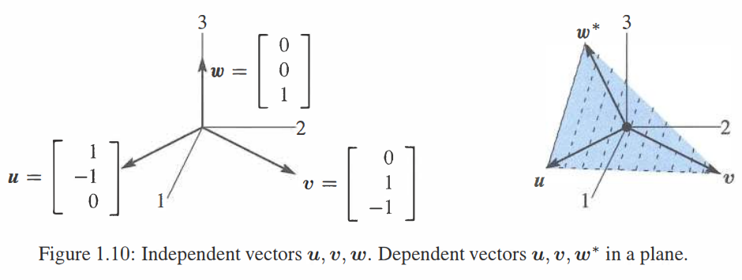

## 矩阵
>1. \\(A=\begin{bmatrix}1&2\\\\3&4\\\\5&6\end{bmatrix}\\) 是一个3x2的矩阵：\\(m=3\\) 行且 \\(n=2\\) 列。
>
>2. \\(Ax=\begin{bmatrix}1&2\\\\3&4\\\\5&6\end{bmatrix}\begin{bmatrix}x_1\\\\x_2\end{bmatrix}\\) 是列的一个线性组合：\\(Ax=x_1 \begin{bmatrix}1\\\\3\\\\5\end{bmatrix}+x_2 \begin{bmatrix}2\\\\4\\\\6\end{bmatrix}\\)。
>
>3. \\(Ax\\) 的三个分量是 \\(A\\) 的3行与向量 \\(x\\) 的点积：\\(\begin{bmatrix}1&2\\\\3&4\\\\5&6\end{bmatrix}\begin{bmatrix}7\\\\8\end{bmatrix}=\begin{bmatrix}1 \cdot 7+2 \cdot 8\\\\3 \cdot 7+4 \cdot 8\\\\5 \cdot 7+6 \cdot 8\end{bmatrix}=\begin{bmatrix}23\\\\53\\\\83\end{bmatrix}\\)。
>
>4. 矩阵形式的方程组 \\(Ax=b:\ \begin{bmatrix}2&5\\\\3&7\end{bmatrix}\begin{bmatrix}x_1\\\\x_2\end{bmatrix}=\begin{bmatrix}b_1\\\\b_2\end{bmatrix}\\) 取代 \\(\begin{matrix}2x_1+5x_2=b_1\\\\3x_1+7x_2=b_2\end{matrix}\\)。
>
>5. \\(Ax=b\\) 解可写成 \\(x=A^{-1}b\\)。但是有些矩阵不允许 \\(A^{-1}\\)。

本节以三个向量 \\(u,v,w\\) 开始。之后将会使用矩阵组合它们。
\\[\textbf{三个向量}\quad u=\begin{bmatrix}1\\\\-1\\\\0\end{bmatrix}\quad v=\begin{bmatrix}0\\\\1\\\\-1\end{bmatrix}\quad w=\begin{bmatrix}0\\\\0\\\\1\end{bmatrix}.\\]
它们在三维空间中的线性组合为 \\(x_1u+x_2v+x_3w\\)：
\\[\tag{1} x_1\begin{bmatrix}1\\\\-1\\\\0\end{bmatrix}+x_2\begin{bmatrix}0\\\\1\\\\-1\end{bmatrix}+x_3\begin{bmatrix}0\\\\0\\\\1\end{bmatrix}=\begin{bmatrix}x_1\\\\x_2-x_1\\\\x_3-x_2\end{bmatrix}.\\]
重点来了：*使用矩阵重写这个组合*。向量 \\(u,v,w\\) 组成矩阵 \\(A\\) 的列。矩阵 “乘以” 向量 \\(x_1,x_2,x_3\\)：
\\[\tag{2} Ax=\begin{bmatrix}1&0&0\\\\-1&1&0\\\\0&-1&1\end{bmatrix}\begin{bmatrix}x_1\\\\x_2\\\\x_3\end{bmatrix}=\begin{bmatrix}x_1\\\\x_2-x_1\\\\x_3-x_2\end{bmatrix}.\\]
数 \\(x_1,x_2,x_3\\) 作为向量 \\(x\\) 的分量。矩阵 \\(A\\) 乘以向量 \\(x\\) 与 方程(1)中三个列的组合 \\(x_1u+x_2v+x_3w\\) 相同。

这不仅仅是对 \\(Ax\\) 的定义，因为重写带来了视角上的关键改变。一开始是数 \\(x_1,x_2,x_3\\) 乘以向量。现在是矩阵在乘以那些数。**矩阵 \\(A\\) 作用在向量 \\(x\\) 上**，作用结果 \\(Ax\\) 是 \\(A\\) 的列一个线性组合 \\(b\\)。  
为了展示作用过程，将 \\(b_1,b_2,b_3\\) 写作 \\(Ax\\) 的分量：
\\[\tag{3} Ax=\begin{bmatrix}1&0&0\\\\-1&1&0\\\\0&-1&1\end{bmatrix}\begin{bmatrix}x_1\\\\x_2\\\\x_3\end{bmatrix}=\begin{bmatrix}x_1\\\\x_2-x_1\\\\x_3-x_2\end{bmatrix}=\begin{bmatrix}b_1\\\\b_2\\\\b_3\end{bmatrix}=b.\\]
这里输入是 \\(x\\) 输出是 \\(b=Ax\\)。这里 \\(A\\) 是一个 **“差异矩阵”** 因为 \\(b\\) 包含了输入向量 \\(x\\) 的差。顶部的差为 \\(x_1-x_0=x_1-0\\)。

下面的例子展示了 \\(x=(1,4,9)\\) 的差：平方数在 \\(x\\) 中，奇数在 \\(b\\) 中。
\\[x=\begin{bmatrix}1\\\\4\\\\9\end{bmatrix}=平方数 \qquad Ax=\begin{bmatrix}1-0\\\\4-1\\\\9-4\end{bmatrix}=\begin{bmatrix}1\\\\3\\\\5\end{bmatrix}=b.\\]
一个4x4的差异矩阵将会保持上面的模式。下一个平方数 \\(x_4=16\\)。下一项差会是 \\(x_4-x_3=16-9=7\\) (下一个奇数)。这个矩阵一次性找到所有差 \\(1,3,5,7\\)。

**重要说明：一次乘一行**。你可能已经了解乘积 \\(Ax\\)，矩阵乘以向量。可能用不同的方式解释，使用行而不是列。通常是取每一行同 \\(x\\) 的点积：
\\[\tag{5} Ax=\begin{bmatrix}1&0&0\\\\-1&1&0\\\\0&-1&1\end{bmatrix}\begin{bmatrix}x_1\\\\x_2\\\\x_3\end{bmatrix}=\begin{bmatrix}(1,0,0) \cdot (x_1,x_2,x_3)\\\\(-1,1,0) \cdot (x_1,x_2,x_3)\\\\(0,-1,1) \cdot (x_1,x_2,x_3)\end{bmatrix}\\]
这些点积结果通过我们在方程(3)中的结果相同。处理 \\(Ax\\) 的一种新的方式是一次处理一列。线性组合是线性代数的关键，且输出 \\(Ax\\) 是 \\(A\\) 的列的一个线性组合。  
处理具体的数时，你可以通过行对 \\(Ax\\) 相乘。处理字母时，按列处理是很好的方式。第 2 章将会在矩阵乘法时重复这些规则，并解释其中的思想。
### 线性方程组
视角的转变是重要的。到现在为止，数 \\(x_1,x_2,x_3\\) 是已知的，右边 \\(b\\) 是未知的。我们通过将 \\(A\\) 乘以 \\(x\\) 得到了向量的差。**现在将 \\(b\\) 看成已知我们寻找 \\(x\\)**。  
> *之前的问题* ：计算线性组合 \\(x_1u+x_2v+x_3w\\) 来求解 \\(b\\)。  
> *现在的问题* ：\\(u,v,w\\) 的哪个线性组合得到一个特定的向量 \\(b\\)。

这是一个 *反问题*——求解输入 \\(x\\) 以得到想要的输出 \\(b=Ax\\)。之前你已经见过类似的问题了，即一个关于 \\(x_1,x_2,x_3\\) 的线性方程的系统，方程的右边是 \\(b_1,b_2,b_3\\)。我将会求解系统 \\(Ax=b\\) 来找到 \\(x_1,x_2,x_3\\)；
\\[
\tag{6} Ax=b \quad 
\begin{matrix}
x_1=b_1\\\\-x_1+x_2=b_2\\\\-x_2+x_3=b_3
\end{matrix}
\qquad
x=A^{-1}b \quad
\begin{matrix}
x_1=b_1\\\\x_2=b_1+b_2\\\\x_3=b_1+b_2+b_3
\end{matrix}.
\\]
事实上，大部分的线性系统都不容易求解。在这个例子中，第一个方程决定了 \\(x_1=b_1\\)。然后第二个方程得到 \\(x_2=b_1+b_2\\)。*因为 \\(A\\) 是三角矩阵故方程组能按顺序 (从上至下) 求解*。  
关注右边 \\(b_1,b_2,b_3\\) 两个特定的取值 \\(0,0,0\\) 和 \\(1,3,5\\)：
\\[
b=\begin{bmatrix}0\\\\0\\\\0\end{bmatrix}\ \text{gives}\ x=\begin{bmatrix}0\\\\0\\\\0\end{bmatrix} \qquad b=\begin{bmatrix}1\\\\3\\\5\end{bmatrix}\ \text{gives}\ x=\begin{bmatrix}1\\\\1+3\\\\1+3+5\end{bmatrix}=\begin{bmatrix}1\\\\4\\\\9\end{bmatrix}.
\\]
第一个解 (全为零) 比表面看起来更加重要。具体说就是：*如果输出 \\(b=0\\)，那么输入必须为 \\(x=0\\)*。这个表述对矩阵 \\(A\\) 为真，但对所有矩阵不为真。我们的第二个例子将会展示 (对于矩阵 \\(C\\)) 如何满足当 \\(C \not=0,x \not=0\\) 时，\\(Cx=0\\)。  
矩阵 \\(A\\) 是 **“可逆的”**。根据 \\(b\\) 我们能够还原 \\(x\\)。将 \\(x\\) 写作 \\(A^{-1}b\\)。

### 逆矩阵
再次重复方程 \\((6)\\) 中的解 \\(x\\)。将会看到一个求和矩阵！
\\[\tag{7}
Ax=b\ \text{is solved by}\ \begin{bmatrix}x_1\\\\x_2\\\\x_3\end{bmatrix}=\begin{bmatrix}b_1\\\\b_1+b_2\\\\b_1+b_2+b_3\end{bmatrix}=\begin{bmatrix}1&0&0\\\\1&1&0\\\\1&1&1\end{bmatrix} \begin{bmatrix}b_1\\\\b_2\\\\b_3\end{bmatrix}. 
\\]
如果 \\(x\\) 的差是 \\(b\\)，那么 \\(b\\) 的和就是 \\(x\\)。对于奇数 \\(b=(1,3,5)\\) 和平方数 \\(x=(1,4,9)\\) 为真。其实对于所有向量都为真。 **方程 \\((7)\\) 中的求和矩阵是差矩阵 \\(A\\) 的逆 \\(A^{-1}\\)**。  
例子：\\(x=(1,2,3)\\) 的差为 \\(b=(1,1,1)\\)。所以 \\(b=Ax\\) 且 \\(x=A^{-1}b\\)：
\\[
Ax=\begin{bmatrix}1&0&0\\\\-1&1&0\\\\0&-1&1\end{bmatrix}\begin{bmatrix}1\\\\2\\\\3\end{bmatrix}=\begin{bmatrix}1\\\\1\\\\1\end{bmatrix} \qquad
A^{-1}b=\begin{bmatrix}1&0&0\\\\1&1&0\\\\1&1&1\end{bmatrix}\begin{bmatrix}1\\\\1\\\\1\end{bmatrix}=\begin{bmatrix}1\\\\2\\\\3\end{bmatrix}.
\\]
方程 \\((7)\\) 中的解向量 \\(x=(x_1,x_2,x_3)\\) 告诉了我们一下两个重要的事实：  
**1.** 对每一个向量 \\(b\\) \\(Ax=b\\) 存在一个解。**2.** 通过矩阵 \\(A^{-1}\\) 得到 \\(x=A^{-1}b\\)。  
下一章将会讨论对于其他方程组 \\(Ax=b\\)，是否总是有解？如何找到它？

*Note on calculus.* 将这些特殊的矩阵与微积分相联系。向量 \\(x\\) 变为函数 \\(x(t)\\)。差 \\(Ax\\) 变为 *导数* \\(dx/dt=b(t)\\)。在相反的方向上，和 \\(A^{-1}b\\) 变成了 \\(b(t)\\) 的 *积分*。**对差的求和相似于导数的积分**。  
微积分基本理论告诉我们：**积分是微分的逆**。
\\[
\tag{8} Ax=b\ \text{and}\ x=A^{-1}b \qquad \frac{dx}{dt}=b\ \text{and}\ x(t)=\int^{t}_{0}b\ dt.
\\]
平方数 \\(0,1,4,9\\) 的差为奇数 \\(1,3,5\\)。\\(x(t)=t^2\\) 的导数为 \\(2t\\)。一个完美的类比是在时间 \\(t=1,2,3\\) 分别得到偶数 \\(b=2,4,6\\)。但是差与导数不完全相同，且此时矩阵 \\(A\\) 得到的不是 \\(2t\\) 而是 \\(2t-1\\)：
\\[\tag{9}
\textbf{后向差分}\qquad x(t)-x(t-1)=t^2-(t-1)^2=t^2-(t^2-2t+1)=2t-1.
\\]
在 Problem Set 将会接着展示 “前向差分” 得到 \\(2t+1\\)。最好的选择 (不总是出现在微积分课上) 是 **中心差分**，使用 \\(x(t+1)-x(t-1)\\)。用从 \\(t+1\\) 到 \\(t-1\\) 的距离 \\(\Delta x\\) 除 \\(\Delta x\\)，这里是 \\(2\\)：
\\[
\tag{10}
x(t)=t^2\ \textbf{的中心差分}\qquad \frac{(t+1)^2-(t-1)^2}{2}=2t.
\\]

### 循环差分矩阵
这个例子继续使用相同列 \\(u\\) 和 \\(v\\) 但 \\(w\\) 换为一个新向量 \\(w^{\*}\\)：  
\\[u=\begin{bmatrix}1\\\\-1\\\\0\end{bmatrix} \quad v=\begin{bmatrix}0\\\\1\\\\-1\end{bmatrix} \quad w^{\*}=\begin{bmatrix}-1\\\\0\\\\1\end{bmatrix}.\\]
此时 \\(u,v,w^{\*}\\) 的线性组合将会得到一个 **循环差分矩阵 \\(C\\)**：
\\[\tag{11}
Cx=\begin{bmatrix}1&0&-1\\\\-1&1&0\\\\0&-1&1\end{bmatrix}\begin{bmatrix}x_1\\\\x_2\\\\x_3\end{bmatrix}=\begin{bmatrix}x_1-x_3\\\\x_2-x_1\\\\x_3-x_2\end{bmatrix}=b.\\]
矩阵 \\(C\\) 不是三角形的。当给定 \\(b\\) 时求解 \\(x\\) 并不是特别简单。事实上找到 \\(Cx=b\\) *解* 是不可能的，因为这三个方程要么有 **无穷多个解** (偶尔的情况) 要么 **无解** (通常的情况)：
\\[\tag{12}
Cx=0\ \textbf{无穷多解}\quad \begin{bmatrix}x_1-x_3\\\\x_2-x_1\\\\x_3-x_2\end{bmatrix}=\begin{bmatrix}0\\\\0\\\\0\end{bmatrix}解得向量满足\begin{bmatrix}x_1\\\\x_2\\\\x_3\end{bmatrix}=\begin{bmatrix}c\\\\c\\\\c\end{bmatrix}.
\\]
每一个常数向量像 \\(x=(3,3,3)\\) 具有零的差当我们循环作用时。不定项常数 \\(c\\) 十分像积分时我们添加的 \\(+C\\)。循环差分第一项为 \\(x_1-x_3\\) 而不是从 \\(x_0=0\\) 开始。  
方程 \\(Cx=b\\) 更多可能是**无解**的情况：
\\[\tag{13}Cx=b \quad \begin{bmatrix}x_1-x_3\\\\x_2-x_1\\\\x_3-x_2\end{bmatrix}=\begin{bmatrix}1\\\\3\\\5\end{bmatrix} \quad \begin{matrix}左边相加为\ 0\\\\右边相加为\ 9\\\\x_1,x_2,x_3\ 无解\end{matrix}\\]
从几何角度看这个例子。没有 \\(u,v,w^{\*}\\) 的线性组合可以生成向量 \\(b=(1,3,5)\\)。所有的线性组合并没有填满整个三维空间。\\(Cx=b\\) 有解的前提是右边必须满足 \\(b_1+b_2+b_3=0\\)，因为左边三项 \\(x_1-x_3,x_2-x_1,x_3-x_2\\) 相加总为零。换一种说法就是：
> 所有的线性组合 \\(x_1u+x_2v+x_3w^{\*}\\) 均位于 \\(b_1+b_2+b_3=0\\) 给定的平面。

这个主题突然把代数和几何联系了起来。线性组合可以填满整个空间，或仅仅某个平面。我们需要一个图像来展示 \\(u,v,w\\) (第一个例子) 和 \\(u,v,w^{\*}\\) (均位于同一个平面) 的核心差异。

### 独立性和相关性
Figure 1.10 展示这些列向量，首先是属于矩阵 \\(A\\) 其次是 \\(C\\)。在两个图像中前两个列向量 \\(u\\) 和 \\(v\\) 相同。如果仅看这两个向量的线性组合，我们将会得到一个二维平面。**关键的问题是第三个向量是否在这个平面中**。  
> **独立性** \\(w\\) 不在 \\(u\\) 和 \\(v\\) 的平面中。  
> **相关性** \\(w^{\*}\\) 在 \\(u\\) 和 \\(v\\) 的平面中。    

重点是新向量 \\(w^{\*}\\) 是 \\(u\\) 和 \\(v\\) 的一个线性组合：
\\[\tag{14}
u+v+w^{\*}=0 \qquad w^{\*}=\begin{bmatrix}-1\\\\0\\\\1\end{bmatrix}=-u-v.
\\]
\\(u,v,w^{\*}\\) 三个向量的分量相加为零。所以它们的线性组合满足 \\(b_1+b_2+b_3=0\\) (如上所示，通过将三个方程相加)。这是关于平面的方程，该平面包含 \\(u\\) 和 \\(v\\) 的所有线性组合。包含 \\(w^{\*}\\) 我们没有得到 *新向量* 因为 \\(w^{\*}\\) 已经位于平面中了。  
原始的 \\(w=(0,0,1)\\) 不在这个平面上：\\(0+0+1 \not= 0\\)。\\(u,v,w\\) 的线性组合填满整个三维空间。我们已经知道这个性质了，因为方程 \\((6)\\) 的解 \\(x=A^{-1}b\\) 对任何 \\(b\\) 能够给出正确的线性组合。  
第三列分别为 \\(w\\) 和 \\(w^{\*}\\) 的两个矩阵 \\(A\\) 和 \\(C\\) 引出了线性代数的两个关键词：独立性和相关性。这门课程的前半部分将会更进一步发展这些思想——我很高兴你能在这两个例子中提前了解它们：
> \\(u,v,w\\) 是**独立**的。没有线性组合除了 \\(0u+0v+0w=0\\) 能给出 \\(b=0\\)。  
> \\(u,v,w^{\*}\\) 是**相关**的。有其他的组合比如 \\(u+v+w^{\*}\\)能给出 \\(b=0\\)。  

在三维空间中你能通过图像来描述它。三个向量在或不在同一平面上。第二章有 \\(n\\) 维空间的 \\(n\\) 个向量。*独立性或相关性* 是关键点。对于 \\(n\ \text{x}\ n\\) 矩阵中的列：  
> 独立的列：\\(Ax=0\\) 有唯一解。\\(A\\) 是 **可逆矩阵**。  
> 相关的列：\\(Cx=0\\) 有多个解。\\(C\\) 是 **奇异矩阵**。

最后我们将会讨论 \\(m\\) 维空间的 \\(n\\) 个向量。具有 \\(n\\) 个列的矩阵 \\(A\\) 此时则是矩形的 (\\(n\ \text{x}\ n\\))。理解 \\(Ax=b\\) 是第三章的课题。

### 关键思想回顾
1. **矩阵乘以向量**：\\(Ax=\\) \\(A\\) 的列的线性组合。
2. \\(Ax=b\\) 解为 \\(x=A^{-1}b\\)，当 \\(A\\) 是可逆矩阵时。
3. 循环矩阵 \\(C\\) 不可逆。它的三个列位于同一个平面。这些相关的列相加得到零向量。\\(Cx=0\\) 有多个解。
4. 本节展望关键思想，尚未完全解释。 

### 典型示例
**1.3 A** 将矩阵 \\(A\\) 的左下角项 \\(a_{31}\\) 变为 \\(a_{31}=1\\)：
\\[Ax=b\quad \begin{bmatrix}1&0&0\\\\-1&1&0\\\\1&-1&1\end{bmatrix}\begin{bmatrix}x_1\\\\x_2\\\\x_3\end{bmatrix}=\begin{bmatrix}x_1\\\\-x_1+x_2\\\\x_1-x_2+x_3\end{bmatrix}=\begin{bmatrix}b_1\\\\b_2\\\\b_3\end{bmatrix}.\\]
**求任意 \\(b\\) 的解 \\(x\\)。从 \\(x=A^{-1}b\\) 读出逆矩阵 \\(A^{-1}\\)**。  
**解** 自顶向下解 (线性三角) 系统 \\(Ax=b\\)：
\\[
\begin{matrix}\text{first}\ x_1=b_1\\\\\text{then}\ x_2=b_1+b_2\\\\\text{then}\ x_3=b_2+b_3\end{matrix} \qquad \text{This says that}\ x=A^{-1}b=\begin{bmatrix}1&0&0\\\\1&1&0\\\\0&1&1\end{bmatrix} \begin{bmatrix}b_1\\\\b_2\\\\b_3\end{bmatrix}.
\\]
\\(A^{-1}\\) 的第一列是关于 \\(b=(1,0,0)\\) 的解。第二列是关于 \\(b=(0,1,0)\\) 的解。第三列是关于 \\(b=(0,1,0)\\) 的解。  
\\(A\\) 的三列仍然是独立的。它们不位于同一个平面。三列的线性组合，使用正确的权重 \\(x_1,x_2,x_3\\) 能产生任意三维向量 \\(b=(b_1,b_2,b_3)\\)。这些权重来自于 \\(x=A^{-1}b\\)。

**1.3 B** \\(E\\) 是一个 **消元矩阵**。\\(E\\) 执行减法而 \\(E^{-1}\\) 执行加法。
\\[
b=Ex\quad \begin{bmatrix}b_1\\\\b_2\end{bmatrix}=\begin{bmatrix}x_1\\\\x_2-lx_1\end{bmatrix}=\begin{bmatrix}1&0\\\\-l&1\end{bmatrix}\begin{bmatrix}x_1\\\\x_2\end{bmatrix}\qquad E=\begin{bmatrix}1&0\\\\-l&1\end{bmatrix}\\]
第一个方程是 \\(x_1=b_1\\)。第二个方程是 \\(x_2-lx_1=b_2\\)。逆矩阵将 \\(lb_1\\) 与 \\(b_2\\) *相加*，因为消元矩阵是 *相减*：
\\[
x=E^{-1}b\quad \begin{bmatrix}x_1\\\\x_2\end{bmatrix}=\begin{bmatrix}b_1\\\\lb_1+b_2\end{bmatrix}=\begin{bmatrix}1&0\\\\l&1\end{bmatrix}\begin{bmatrix}b_1\\\\b_2\end{bmatrix}\qquad E^{-1}=\begin{bmatrix}1&0\\\\l&1\end{bmatrix}
\\]

**1.3 C** 将矩阵 \\(C\\) 从循环差分变为 **中心差分** 得到 \\(x_3-x_1\\)：
\\[\tag{15}
Cx=b\quad \begin{bmatrix}0&1&0\\\\-1&0&1\\\\0&-1&0\end{bmatrix}\begin{bmatrix}x_1\\\\x_2\\\\x_3\end{bmatrix}=\begin{bmatrix}x_2-0\\\\x_3-x_1\\\\0-x_2\end{bmatrix}-\begin{bmatrix}b_1\\\\b_2\\\\b_3\end{bmatrix}.
\\]
\\(Cx=b\\) 只有当 \\(b_1+b_3=x_2-x_2=0\\) 才可解。这是三维空间向量 \\(b\\) 的一个平面。\\(C\\) 的每一列均在平面上，矩阵不可逆。所以这个平面包含了这些列的所有线性组合 (即所有的向量 \\(Cx\\))。

添加了零所以你能看到 \\(C\\) 得到 “中心差分”。\\(Cx\\) 的行 \\(i\\) 为 \\(x_{i+1}\\) (中心右部) 减去 \\(x_{i-1}\\) (中心左部)。下面是一个 4x4：
\\[\tag{16}
\begin{bmatrix}0&1&0&0\\\\-1&0&1&0\\\\0&-1&0&1\\\\0&0&-1&0\end{bmatrix} \begin{bmatrix}x_1\\\\x_2\\\\x_3\\\\x_4\end{bmatrix}=\begin{bmatrix}x_2-0\\\\x_3-x_1\\\\x_4-x_2\\\\0-x_3\end{bmatrix}=\begin{bmatrix}b_1\\\\b_2\\\\b_3\\\\b_4\end{bmatrix}
\\]  
令人惊讶的是这个矩阵现在是可逆的！第一行和最后一行给出了 \\(x_2\\) 和 \\(x_3\\)。然后中间的行给出了 \\(x_1\\) 和 \\(x_4\\)。这时写出逆矩阵 \\(C^{-1}\\) 是可能的。但是 5x5 情形又会是奇异的 (不可逆)...
